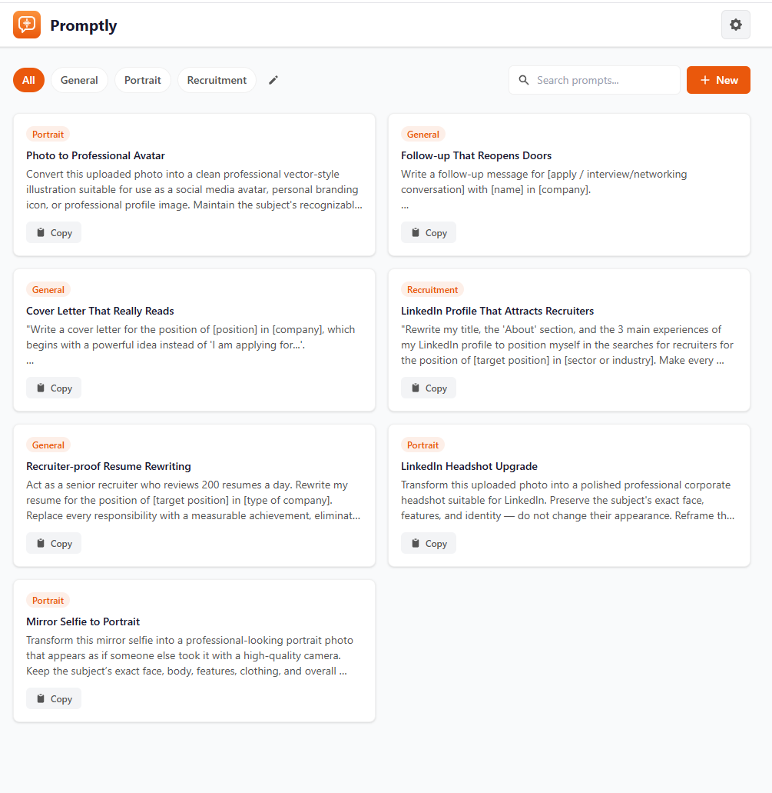

# Prompty



A self-hosted prompt library for managing and organizing your AI prompts. Store, search, and discover prompts across categories — all synced server-side so your library is available everywhere.

## Quick Start (Docker)

```bash
docker run -d \
  --name prompty \
  -p 3060:3060 \
  -v prompty_data:/app/data \
  --restart unless-stopped \
  larsmikki/prompty:latest
```

Then open [http://localhost:3060](http://localhost:3060).

## Docker Compose

Save as `docker-compose.yml` (or use the included `config.yaml`):

```yaml
version: "3.8"

services:
  prompty:
    container_name: prompty
    image: larsmikki/prompty:latest
    ports:
      - "3060:3060"
    volumes:
      - prompty_data:/app/data
    deploy:
      replicas: 1
      restart_policy:
        condition: on-failure
        delay: 5s
        max_attempts: 3
    healthcheck:
      test: ["CMD", "wget", "--spider", "-q", "http://localhost:3060/api/health"]
      interval: 30s
      timeout: 5s
      retries: 3
      start_period: 10s

volumes:
  prompty_data:
```

```bash
docker compose -f config.yaml up -d
```

## Environment Variables

| Variable | Default | Description |
|----------|---------|-------------|
| `PORT` | `3060` | Port the server listens on |
| `DATA_DIR` | `/app/data` | Directory where the SQLite database is stored |

## Features

- **Prompt library** — create, edit, and delete prompts with titles and categories
- **Categories** — organize prompts into custom categories
- **Search** — full-text search across prompt titles and content
- **Discover** — browse 100+ pre-made prompts across 12 categories (Writing, Business, Development, and more)
- **Export / Import** — backup and restore your library as JSON
- **Themes** — 10 built-in light and dark themes
- **Persistent storage** — all data stored in SQLite via a Docker volume

## Development

Requirements: Node.js 20+

```bash
npm install
npm run dev
```

- Client: [http://localhost:3060](http://localhost:3060) (Vite dev server)
- Server: [http://localhost:3061](http://localhost:3061) (API)

To build the production image locally:

```bash
docker build -t prompty .
```
